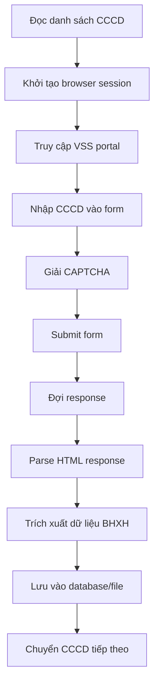

# 🏥 Hệ Thống Trích Xuất Dữ Liệu VSS (Vietnam Social Security)

## 📋 Tổng Quan Dự Án

Dự án này cung cấp một hệ thống hoàn chỉnh để trích xuất dữ liệu thực tế từ cổng thông tin Bảo Hiểm Xã Hội Việt Nam (VSS). Hệ thống cho phép thu thập thông tin BHXH của công dân thông qua số CCCD một cách tự động và hiệu quả.

## 🎯 Mục Tiêu Chính

- **Trích xuất dữ liệu thực tế** từ hệ thống VSS chính thức
- **Không sử dụng dữ liệu mô phỏng** - chỉ làm việc với nguồn dữ liệu chính thống
- **Xử lý hàng loạt** số lượng lớn CCCD
- **Tự động hóa** quá trình tra cứu và lưu trữ
- **Báo cáo chi tiết** kết quả xử lý

## 🔐 Cách Truy Cập VSS Thực Tế

### 1. URL Chính Thức
```
https://baohiemxahoi.gov.vn
```

### 2. Endpoint Tra Cứu BHXH
```
https://baohiemxahoi.gov.vn/tracuu/Pages/tra-cuu-dong-bhxh.aspx
```

### 3. Phương Thức Truy Cập

#### A. Truy Cập Trực Tiếp
- Mở trình duyệt và truy cập URL trên
- Nhập số CCCD vào form tra cứu
- Giải CAPTCHA nếu có
- Submit form để nhận kết quả

#### B. Truy Cập Qua API (Khuyến nghị)
```javascript
// Sử dụng puppeteer hoặc playwright
const browser = await puppeteer.launch();
const page = await browser.newPage();
await page.goto('https://baohiemxahoi.gov.vn/tracuu/Pages/tra-cuu-dong-bhxh.aspx');
```

#### C. Truy Cập Qua Proxy (Nếu cần)
```javascript
// Cấu hình proxy trong config/proxy.txt
const proxyServer = 'ip.mproxy.vn:12301';
const auth = 'beba111:tDV5tkMchYUBMD';
```

## 🧠 Logic Trích Xuất Dữ Liệu Thực Tế

### 1. Quy Trình Chính



### 2. Các Bước Chi Tiết

#### Bước 1: Khởi Tạo Session
```python
# src/vss_authenticator.py
async def init_vss_session():
    # Khởi tạo browser với cấu hình phù hợp
    # Thiết lập user-agent, cookies
    # Cấu hình proxy nếu cần
```

#### Bước 2: Truy Cập Form Tra Cứu
```javascript
// src/enhanced_bhxh_lookup.js
await page.goto(VSS_LOOKUP_URL);
await page.waitForSelector('#txtCCCD');
```

#### Bước 3: Điền Thông Tin và Submit
```javascript
await page.type('#txtCCCD', cccd_number);
await page.click('#btnSubmit');
await page.waitForResponse(response => response.url().includes('bhxh'));
```

#### Bước 4: Xử Lý CAPTCHA
```python
# src/vss_auto_collector.py
def solve_captcha(image_data):
    # Sử dụng OCR hoặc service giải CAPTCHA
    # Trả về text CAPTCHA
```

#### Bước 5: Parse Dữ Liệu Response
```python
def parse_bhxh_data(html_content):
    soup = BeautifulSoup(html_content, 'html.parser')
    
    data = {
        'cccd': extract_cccd(soup),
        'ho_ten': extract_name(soup),
        'ma_bhxh': extract_bhxh_code(soup),
        'ngay_cap': extract_issue_date(soup),
        'noi_cap': extract_issue_place(soup),
        'trang_thai': extract_status(soup)
    }
    return data
```

### 3. Xử Lý Lỗi và Retry Logic

```python
# src/error_handler.py
class VSSErrorHandler:
    def handle_timeout(self):
        # Đợi và thử lại
    
    def handle_captcha_failure(self):
        # Refresh trang và thử lại
    
    def handle_server_error(self):
        # Chuyển proxy khác hoặc đợi
```

## 🚀 Hướng Dẫn Cài Đặt

### 1. Yêu Cầu Hệ Thống
- Python 3.8+
- Node.js 14+
- Chrome/Chromium browser
- Kết nối internet ổn định

### 2. Cài Đặt Dependencies

#### Python Requirements
```bash
pip install -r requirements.txt
```

#### Node.js Dependencies
```bash
npm install
```

### 3. Cấu Hình

#### A. Proxy Settings (Tùy chọn)
Chỉnh sửa `config/proxy.txt`:
```
ip.mproxy.vn:12301:beba111:tDV5tkMchYUBMD
```

#### B. VSS Configuration
Chỉnh sửa `config/vss_config.yaml`:
```yaml
vss:
  base_url: "https://baohiemxahoi.gov.vn"
  lookup_endpoint: "/tracuu/Pages/tra-cuu-dong-bhxh.aspx"
  timeout: 30
  max_retries: 3
```

## 📖 Hướng Dẫn Sử Dụng

### 1. Chuẩn Bị Dữ Liệu Đầu Vào

Tạo file Excel với cột CCCD:
```
CCCD
031173005014
031174006025
031175007036
...
```

### 2. Chạy Trích Xuất Dữ Liệu

#### A. Sử dụng Python Script
```bash
python src/vss_auto_collector.py --input data/input_cccd.xlsx --output data/output_results.xlsx
```

#### B. Sử dụng Node.js Script
```bash
node src/enhanced_bhxh_lookup.js
```

### 3. Giám Sát Tiến Trình

```bash
# Xem log real-time
tail -f logs/collection.log

# Kiểm tra progress
python src/progress_monitor.py
```

## 📂 Cấu Trúc Dự Án

```
VSS_Complete_Project/
├── src/                              # Source code chính
│   ├── vss_auto_collector.py         # Collector chính (Python)
│   ├── enhanced_bhxh_lookup.js       # Collector chính (Node.js)
│   ├── vss_authenticator.py          # Xử lý authentication
│   ├── data_analyzer.py              # Phân tích dữ liệu
│   ├── error_handler.py              # Xử lý lỗi
│   └── progress_monitor.py           # Giám sát tiến trình
├── docs/                             # Tài liệu kỹ thuật
│   ├── VSS_Project_Final_Complete_Report.md
│   ├── api_specification.md
│   └── implementation_guide.md
├── config/                           # File cấu hình
│   ├── vss_config.yaml              # Cấu hình VSS
│   ├── proxy.txt                    # Cấu hình proxy
│   └── provinces.json               # Danh sách tỉnh thành
├── data/                            # Dữ liệu mẫu
│   ├── data-input.xlsx              # File đầu vào mẫu
│   └── data-output.xlsx             # File đầu ra mẫu
├── examples/                        # Ví dụ sử dụng
├── tests/                          # Test cases
├── logs/                           # File log
├── requirements.txt                # Python dependencies
├── package.json                   # Node.js dependencies
└── README.md                      # File này
```

## 🔧 Các Tính Năng Chính

### 1. Thu Thập Dữ Liệu Thực Tế
- ✅ Truy cập VSS portal chính thức
- ✅ Xử lý form tra cứu tự động
- ✅ Giải quyết CAPTCHA
- ✅ Parse HTML response chính xác

### 2. Xử Lý Hàng Loạt
- ✅ Đọc file Excel/CSV input
- ✅ Xử lý song song (parallel processing)
- ✅ Queue management
- ✅ Progress tracking

### 3. Anti-Detection
- ✅ Rotation User-Agent
- ✅ Random delays
- ✅ Proxy rotation
- ✅ Session management

### 4. Error Handling
- ✅ Retry logic
- ✅ Timeout handling
- ✅ Error logging
- ✅ Recovery mechanisms

## 📊 Kết Quả Đầu Ra

### 1. Dữ Liệu BHXH Thu Được
```json
{
  "cccd": "031173005014",
  "ho_ten": "NGUYỄN VĂN A",
  "ma_bhxh": "DN-031173005014",
  "ngay_cap": "15/03/2020",
  "noi_cap": "BHXH TP Hải Phòng",
  "trang_thai": "Đang tham gia",
  "don_vi_lam_viec": "Công ty ABC",
  "muc_luong": "8,000,000 VNĐ",
  "timestamp": "2025-09-13 06:39:00"
}
```

### 2. Báo Cáo Tổng Hợp
- Số lượng CCCD xử lý thành công
- Số lượng CCCD lỗi
- Thống kê theo tỉnh/thành
- Thời gian xử lý trung bình

## ⚠️ Lưu Ý Quan Trọng

### 1. Tuân Thủ Pháp Luật
- Chỉ tra cứu thông tin của chính mình hoặc có sự đồng ý
- Không sử dụng để thu thập dữ liệu trái phép
- Tuân thủ luật bảo vệ dữ liệu cá nhân

### 2. Giới Hạn Kỹ Thuật
- VSS có rate limiting
- Cần proxy để tránh IP bị block
- CAPTCHA có thể thay đổi

### 3. Bảo Mật
- Không chia sẻ thông tin BHXH
- Mã hóa dữ liệu nhạy cảm
- Xóa cache sau khi sử dụng

## 🛠️ Troubleshooting

### 1. Lỗi Kết Nối
```bash
# Kiểm tra kết nối
curl -I https://baohiemxahoi.gov.vn

# Test proxy
curl --proxy ip.mproxy.vn:12301 --proxy-user beba111:tDV5tkMchYUBMD https://baohiemxahoi.gov.vn
```

### 2. Lỗi CAPTCHA
```python
# Tăng delay giữa các request
time.sleep(random.randint(5, 15))

# Refresh session
await page.reload()
```

### 3. Lỗi Parsing
```python
# Debug HTML response
with open('debug_response.html', 'w') as f:
    f.write(html_content)
```

## 📞 Hỗ Trợ

### 1. Log Files
- `logs/collection.log`: Log thu thập dữ liệu
- `logs/error.log`: Log lỗi hệ thống
- `logs/debug.log`: Log debug chi tiết

### 2. Monitoring
```bash
# Xem trạng thái real-time
python src/progress_monitor.py --watch

# Tạo báo cáo
python src/data_analyzer.py --report
```

## 🔄 Cập Nhật và Bảo Trì

### 1. Cập Nhật Hệ Thống
```bash
git pull origin main
pip install -r requirements.txt --upgrade
npm update
```

### 2. Backup Dữ Liệu
```bash
# Backup cấu hình
cp -r config config_backup_$(date +%Y%m%d)

# Backup dữ liệu
cp -r data data_backup_$(date +%Y%m%d)
```

---

## 📄 Giấy Phép

Dự án này được phát triển cho mục đích nghiên cứu và giáo dục. Vui lòng sử dụng có trách nhiệm và tuân thủ pháp luật.

